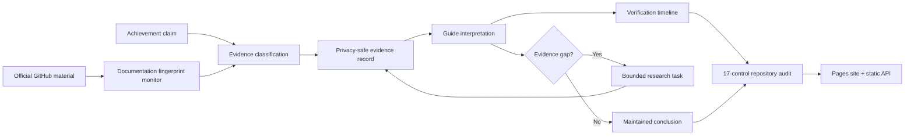

<p align="center">
  
</p>

<p align="center">
  <a href="https://github.com/Conroy1988/Achievements/actions/workflows/content-quality.yml"></a>
  <a href="https://github.com/Conroy1988/Achievements/actions/workflows/repository-audit.yml"></a>
  <a href="https://conroy1988.github.io/Achievements/"></a>
  <a href="https://github.com/Conroy1988/Achievements/releases/tag/v1.4.0"></a>
  <a href="docs/research-hub.md"></a>
  <a href="LICENSE"></a>
</p>

<p align="center">
  <strong>The evidence-led reference for GitHub profile achievements.</strong><br>
  Official documentation, reproducible behaviour, historical records, account observations, contradictions, and uncertainty—kept separate and reviewable.
</p>

<p align="center">
  <a href="https://conroy1988.github.io/Achievements/"><strong>Explore the encyclopedia</strong></a>
  · <a href="https://conroy1988.github.io/Achievements/search/">Search</a>
  · <a href="docs/evidence-register.md">Evidence</a>
  · <a href="docs/research-hub.md">Research campaign</a>
  · <a href="docs/api-reference.md">Static API</a>
  · <a href="docs/health-dashboard.md">Health</a>
</p>

---

## Current operating state

| Measure | Current state |
|---|---:|
| **Formal release baseline** | `v1.4.0` |
| **Active research campaign** | `v1.5.0` |
| **Canonical achievement guides** | 9 |
| **Active achievements** | 7 |
| **Retired achievements** | 2 |
| **Public API endpoints** | 16 |
| **Unified audit controls** | 17 |
| **Repository health** | 100/100 — Excellent |
| **Tracked Markdown files** | 220 |
| **External source URLs** | 88 |

The formal v1.4.0 release remains the immutable published evidence-quality baseline. Development on `main` is now running the v1.5.0 research campaign, which classifies remaining work as active, blocked, monitored, queued, or complete instead of treating every unresolved question as equivalent.

## Why this exists

GitHub does not publish complete rules for every profile achievement or tier. Public discussion therefore mixes several fundamentally different forms of information:

- official GitHub documentation;
- behaviour reproduced under controlled conditions;
- credible but incomplete observations;
- historical screenshots and archived material;
- community-reported thresholds;
- assumptions repeated until they appear authoritative.

The **GitHub Achievement Encyclopedia** prevents those categories from collapsing into one another.

| Evidence-led | Research-ready | Machine-readable |
|---|---|---|
| Material claims are classified, dated, and connected to reviewable evidence records. | Uncertainty becomes a bounded task with an explicit question, method, privacy boundary, and acceptance criteria. | Validated JSON endpoints preserve evidence levels, dates, limitations, decisions, and unresolved state. |
| [Confidence model](docs/evidence-strength-levels.md) | [Research hub](docs/research-hub.md) | [API reference](docs/api-reference.md) |

> [!IMPORTANT]
> Numerical thresholds and trigger details are never promoted merely because they are popular. Claims remain community-reported, observed, or unknown until the available evidence supports a stronger classification.

## Achievement catalogue

### Active achievements

| Achievement | What it recognises | Tiered | Guide |
|---|---|:---:|---|
| **Pull Shark** | Having pull requests merged | Yes | [Open guide](docs/achievements/pull-shark.md) |
| **Quickdraw** | Closing an issue or pull request shortly after opening it | No | [Open guide](docs/quickdraw.md) |
| **YOLO** | Merging a pull request without review | No | [Open guide](docs/achievements/yolo.md) |
| **Pair Extraordinaire** | Co-authoring commits in merged pull requests | Yes | [Open guide](achievements/pair-extraordinaire.md) |
| **Galaxy Brain** | Receiving accepted answers in GitHub Discussions | Yes | [Open guide](docs/achievements/galaxy-brain.md) |
| **Starstruck** | Owning a repository that receives stars | Yes | [Open guide](docs/achievements/starstruck.md) |
| **Public Sponsor** | Publicly sponsoring open-source work through GitHub Sponsors | No | [Open guide](docs/achievements/public-sponsor.md) |

### Retired achievements

| Achievement | Historical trigger | Guide |
|---|---|---|
| **Arctic Code Vault Contributor** | Contribution to qualifying repositories archived in 2020 | [Open guide](docs/arctic-code-vault-contributor.md) |
| **Mars 2020 Contributor** | Contribution to repositories used by the Mars 2020 mission | [Open guide](docs/mars-2020-contributor.md) |

Retired achievements remain documented as history and are not presented as currently earnable.

## Evidence pipeline



| Evidence level | Meaning |
|---|---|
| **Official** | Directly documented by GitHub |
| **Confirmed** | Reproduced with sufficient dated evidence |
| **Observed** | Supported by credible observations without full reproduction |
| **Community-reported** | Third-party reporting without adequate independent confirmation |
| **Unknown** | Insufficient evidence for a reliable conclusion |

## v1.5.0 research campaign

The live campaign currently contains:

| State | Count | Purpose |
|---|---:|---|
| **Active** | 3 | Work currently being pursued |
| **Blocked** | 1 | Valuable work without the required safe evidence conditions |
| **Monitoring** | 1 | Edge cases tracked through legitimate public history |
| **Queued** | 2 | Defined work ready for future research |
| **Good first research tasks** | 1 | Beginner-accessible, privacy-safe contribution route |

### Active priorities

- Independently reproduce the remaining YOLO review-state boundary.
- Reproduce Pair Extraordinaire merge-attribution behaviour across legitimate merge histories.
- Collect privacy-safe observations of achievement-processing delay.

### Blocked and monitored boundaries

- Pair Extraordinaire tier thresholds remain blocked until exact qualifying counts can be observed without manufacturing meaningless pull requests.
- Starstruck ownership, transfer, archive, deletion, restoration, and revocation behaviour remains under observation.
- Galaxy Brain and Public Sponsor edge-case work is queued with explicit privacy and reproducibility requirements.

Open the [Contributor Research Hub](docs/research-hub.md) for exact task IDs, methods, acceptance criteria, and current state.

## Research infrastructure

| Surface | Purpose |
|---|---|
| [Evidence register](docs/evidence-register.md) | Privacy-safe canonical evidence records |
| [Evidence policy](docs/evidence-register-policy.md) | Provenance, publication, privacy, contradiction, and review rules |
| [Official-document monitor](docs/official-document-monitor.md) | Fingerprints for tracked GitHub documentation |
| [Verification timelines](docs/verification-timelines.md) | Dated review histories and historical gaps |
| [Research hub](docs/research-hub.md) | Campaign-classified contribution tasks |
| [Research issue form](.github/ISSUE_TEMPLATE/research-task.yml) | Structured reproduction results and limitations |
| [Health dashboard](docs/health-dashboard.md) | Generated operational posture |

## Public static API

The repository publishes machine-readable data for:

- discovery and schema metadata;
- the complete achievement catalogue;
- one endpoint per achievement;
- public evidence records;
- verification timelines;
- the research queue; and
- repository health.

Start with [`api/index.json`](api/index.json) or the [API reference](docs/api-reference.md).

> [!NOTE]
> Structured delivery does not strengthen a claim. API consumers should preserve evidence level, reviewer decision, reproduction state, dates, precision, limitations, and task status.

## Quality and governance

The unified audit protects:

- Markdown and front-matter integrity;
- catalogue, tier, route, and metadata contracts;
- evidence and timeline alignment;
- official-document fingerprint baselines;
- research-task references and campaign state;
- source resilience and external-link inventory;
- generated API drift;
- search, Jekyll, and visual output;
- release and maintenance policy;
- privacy and prohibited-engagement rules.

Run it locally:

```bash
python scripts/repository_audit.py
```

## Project principles

1. **Evidence before certainty.** Popularity is not verification.
2. **No artificial engagement.** No spam, fake contributions, manufactured stars, deceptive co-authorship, or meaningless pull requests.
3. **Dates matter.** Evidence age and review history remain visible.
4. **Corrections remain traceable.** Superseded conclusions are amended through reviewable history.
5. **Historical context is preserved.** Retired achievements are documented without being advertised as active.
6. **Structured data retains uncertainty.** JSON does not upgrade evidence.
7. **Privacy is non-negotiable.** Credentials, private repository data, billing material, and unnecessary personal identifiers are excluded.

## Contributing

Corrections, dated observations, independent reproductions, contradictory evidence, source replacements, accessibility work, and data-contract improvements are welcome.

Start with the [research hub](docs/research-hub.md), then use the [structured research form](https://github.com/Conroy1988/Achievements/issues/new?template=research-task.yml) or read [CONTRIBUTING.md](CONTRIBUTING.md).

A useful contribution does not need to prove a claim. A well-documented failed reproduction can materially improve the reference.

---

<p align="center">
  <strong>Accuracy over folklore. Evidence over assumption. History without ambiguity.</strong>
</p>

<p align="center">
  <a href="https://conroy1988.github.io/Achievements/">Live encyclopedia</a>
  · <a href="https://conroy1988.github.io/Achievements/search/">Search</a>
  · <a href="docs/research-hub.md">Research</a>
  · <a href="docs/api-reference.md">API</a>
  · <a href="docs/health-dashboard.md">Health</a>
  · <a href="LICENSE">MIT Licence</a>
</p>

<p align="center">
  Maintained by <a href="https://github.com/Conroy1988">Conroy1988</a> for the GitHub community.
</p>
