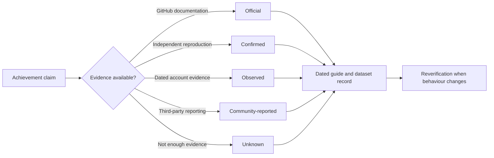
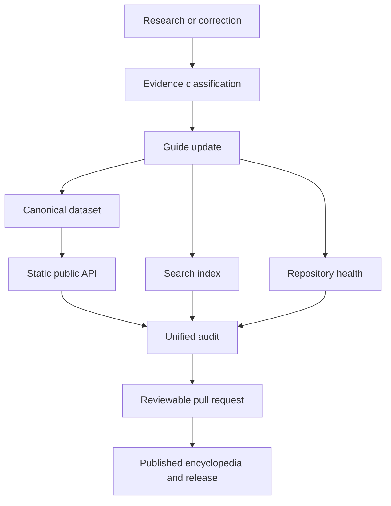

  

  
  
  
  
  
  

  <strong>The evidence-led reference for GitHub profile achievements.</strong> 
  Discover what each achievement means, how it is earned, which thresholds are verified,
  what remains uncertain, and how the rules have changed over time.

  <a href="https://conroy1988.github.io/Achievements/"><strong>Explore the live encyclopedia</strong></a>
  ·
  <a href="https://conroy1988.github.io/Achievements/search/">Search and filter</a>
  ·
  <a href="docs/achievement-index.md">Browse every achievement</a>
  ·
  <a href="docs/api-reference.md">Use the API</a>
  ·
  <a href="CONTRIBUTING.md">Contribute evidence</a>

---

<table align="center">
  <tr>
    <td align="center"><strong>7</strong> Active achievements</td>
    <td align="center"><strong>2</strong> Retired achievements</td>
    <td align="center"><strong>13</strong> Public API endpoints</td>
    <td align="center"><strong>12</strong> Unified audit controls</td>
  </tr>
</table>

## More than a badge list

GitHub does not publish complete rules for every achievement or tier. That creates a difficult mix of official documentation, reproducible behaviour, historical evidence, account observations, and community folklore.

The **GitHub Achievement Encyclopedia** separates those sources instead of presenting every claim with equal certainty.

| Evidence-led | Practical | Machine-readable |
|---|---|---|
| Every material claim is classified and dated. | Each guide explains triggers, exclusions, delays, and legitimate qualification routes. | A validated dataset, JSON Schema, static API, and health endpoint expose the same evidence model to tools. |
| [See the confidence model](docs/evidence-strength-levels.md) | [Search the encyclopedia](search.md) | [Open the API reference](docs/api-reference.md) |

> [!IMPORTANT]
> Numerical thresholds that GitHub has not officially documented remain clearly labelled as community-reported or otherwise unconfirmed until they can be independently reproduced.

## Achievement catalogue

### Active achievements

| Achievement | What it recognises | Tiered | Guide |
|---|---|:---:|:---:|
| **Pull Shark** | Having pull requests merged | Yes | [Open guide](docs/achievements/pull-shark.md) |
| **Quickdraw** | Closing an issue or pull request shortly after opening it | No | [Open guide](docs/quickdraw.md) |
| **YOLO** | Merging a pull request without review | No | [Open guide](docs/achievements/yolo.md) |
| **Pair Extraordinaire** | Co-authoring commits in merged pull requests | Yes | [Open guide](achievements/pair-extraordinaire.md) |
| **Galaxy Brain** | Receiving accepted answers in GitHub Discussions | Yes | [Open guide](docs/achievements/galaxy-brain.md) |
| **Starstruck** | Owning a repository that receives stars | Yes | [Open guide](docs/achievements/starstruck.md) |
| **Public Sponsor** | Publicly sponsoring open-source work through GitHub Sponsors | No | [Open guide](docs/achievements/public-sponsor.md) |

### Retired achievements

| Achievement | Historical trigger | Status | Guide |
|---|---|:---:|:---:|
| **Arctic Code Vault Contributor** | Contributing to qualifying repositories included in the 2020 archive | Retired | [Open guide](docs/arctic-code-vault-contributor.md) |
| **Mars 2020 Contributor** | Contributing to repositories used by the Mars 2020 mission | Retired | [Open guide](docs/mars-2020-contributor.md) |

> [!TIP]
> Use the [interactive search](search.md) for aliases and combined filters, or start with the [canonical achievement index](docs/achievement-index.md) for a compact non-JavaScript route to every guide.

## Evidence before certainty

Every claim moves through the same evidence pipeline:

| Level | Meaning | How to read it |
|---|---|---|
| **Official** | Directly documented by GitHub | Strongest available source |
| **Confirmed** | Reproduced with sufficient dated evidence | Reliable, but not necessarily officially documented |
| **Observed** | Seen in one or more accounts without full reproduction | Useful evidence with limited generalisability |
| **Community-reported** | Reported by third parties without adequate independent confirmation | Treat as provisional |
| **Unknown** | Insufficient evidence for a reliable claim | No confident conclusion stated |

Read the full [evidence and confidence model](docs/evidence-strength-levels.md) and [verification methodology](docs/verification-methodology.md).

## Choose your route

<table>
  <tr>
    <td width="50%" valign="top">
      <h3>🏆 I want to understand an achievement</h3>
      
Open the catalogue, choose an active or retired achievement, and follow its trigger, exclusions, timing notes, and evidence classification.

      
<a href="docs/achievement-index.md"><strong>Browse achievement guides →</strong></a>

    </td>
    <td width="50%" valign="top">
      <h3>🔎 I want to find something quickly</h3>
      
Search names, aliases, triggers, evidence labels, categories, verification freshness, and major project references.

      
<a href="search.md"><strong>Search and filter →</strong></a>

    </td>
  </tr>
  <tr>
    <td width="50%" valign="top">
      <h3>🧪 I want to verify a claim</h3>
      
Use the confidence model to distinguish official rules from reproduced behaviour, observations, and community reports.

      
<a href="docs/evidence-strength-levels.md"><strong>Inspect the evidence model →</strong></a>

    </td>
    <td width="50%" valign="top">
      <h3>⚙️ I need structured data</h3>
      
Use static JSON endpoints for the complete catalogue, individual records, schema discovery, and repository health.

      
<a href="docs/api-reference.md"><strong>Open the API reference →</strong></a>

    </td>
  </tr>
  <tr>
    <td width="50%" valign="top">
      <h3>📊 I want the current project state</h3>
      
Review verification freshness, workflow conclusions, source resilience, release state, and maintenance backlog.

      
<a href="docs/health-dashboard.md"><strong>Open repository health →</strong></a>

    </td>
    <td width="50%" valign="top">
      <h3>📝 I found new evidence</h3>
      
Submit a dated observation, reproduction, correction, source update, or accessibility improvement.

      
<a href="CONTRIBUTING.md"><strong>Contribute to the project →</strong></a>

    </td>
  </tr>
</table>

## Built for trust

The encyclopedia is maintained as a documentation and data product, not a collection of untraceable tips.

| Control | What it protects |
|---|---|
| **Repository-wide Markdown** | Consistent, readable documentation across repository-owned files |
| **Catalogue consistency** | The index and navigation hub contain the same nine guides |
| **Achievement data contract** | Dataset names, paths, tiers, dates, and guide metadata cannot drift |
| **Verification freshness** | Missing, malformed, future, and stale verification dates are detected |
| **Source resilience inventory** | External references remain visible, classified, and maintainable |
| **Public API drift validation** | Generated endpoints remain exact products of the canonical dataset |
| **Search browser tests** | Aliases, filters, routing, and accessible announcements behave correctly |
| **Jekyll and visual validation** | The public site remains deployable and visually stable on desktop and mobile |
| **Unified repository audit** | Twelve controls produce one authoritative Markdown and JSON result |

## Project map

| Area | Purpose |
|---|---|
| [`search.md`](search.md) | Accessible achievement and project-reference search |
| [`docs/achievement-index.md`](docs/achievement-index.md) | Canonical catalogue of active and retired achievements |
| [`data/achievements.json`](data/achievements.json) | Canonical machine-readable achievement records |
| [`data/achievement.schema.json`](data/achievement.schema.json) | JSON Schema data contract |
| [`docs/api-reference.md`](docs/api-reference.md) | Static public API documentation |
| [`api/index.json`](api/index.json) | API discovery and endpoint index |
| [`docs/health-dashboard.md`](docs/health-dashboard.md) | Generated operational health view |
| [`docs/repository-audit.md`](docs/repository-audit.md) | Unified 12-control audit contract |
| [`docs/evidence-strength-levels.md`](docs/evidence-strength-levels.md) | Shared confidence vocabulary |
| [`docs/verification-methodology.md`](docs/verification-methodology.md) | Research and reproduction process |
| [`CONTRIBUTING.md`](CONTRIBUTING.md) | Contribution requirements and review expectations |
| [`MAINTENANCE.md`](MAINTENANCE.md) | Review cadence, evidence ageing, and incident handling |
| [`RELEASES.md`](RELEASES.md) | Semantic-version release policy |

## Project principles

1. **Evidence before certainty.** Community observations are never presented as official fact.
2. **No artificial engagement.** The project does not promote spam, fake contributions, or deceptive activity.
3. **Dates matter.** GitHub behaviour changes; verification dates make evidence age visible.
4. **Corrections remain traceable.** Disputed or superseded claims are corrected through reviewable history.
5. **Historical context is preserved.** Retired achievements remain documented without being presented as earnable.
6. **Structured data retains uncertainty.** JSON delivery never strengthens a claim beyond its recorded evidence.
7. **Privacy is non-negotiable.** Verification should not require private account, billing, repository, or analytics data.

## Contributing

Corrections, dated observations, reproductions, source updates, accessibility improvements, achievement research, and data-contract changes are welcome.

Before opening a pull request:

1. Read the [contribution guidelines](CONTRIBUTING.md).
2. Classify the evidence using the [confidence model](docs/evidence-strength-levels.md).
3. Follow the [achievement guide standard](docs/achievement-guide-standard.md).
4. Keep guide, dataset, schema, search, and API implications aligned.
5. Include dates, sources, limitations, and reproduction details where applicable.
6. Avoid artificial activity undertaken solely to manufacture engagement signals.

> [!NOTE]
> A useful contribution does not need to prove a claim. Well-documented contradictory evidence, uncertainty, and failed reproduction attempts can materially improve the reference.

## Maintenance and verification

The project follows a defined maintenance cycle:

- **Weekly:** unified repository audit, full links, verification freshness, health refresh, and visual comparison.
- **Monthly:** issue, workflow, dependency, source availability, and evidence review.
- **Quarterly:** source freshness and award-behaviour sampling.
- **Annually:** complete guide, governance, accessibility, metadata, automation, dataset, and API review.
- **Event-driven:** immediate review after relevant GitHub product changes.

See the [maintenance policy](MAINTENANCE.md) for evidence-ageing rules, incident handling, and phase reopening criteria.

---

  <strong>Accuracy over folklore. Evidence over assumption. History without ambiguity.</strong>

  <a href="https://conroy1988.github.io/Achievements/">Live encyclopedia</a>
  ·
  <a href="https://conroy1988.github.io/Achievements/search/">Search</a>
  ·
  <a href="docs/api-reference.md">API</a>
  ·
  <a href="docs/health-dashboard.md">Health</a>
  ·
  <a href="CONTRIBUTING.md">Contribute</a>
  ·
  <a href="LICENSE">MIT Licence</a>

  Maintained by <a href="https://github.com/Conroy1988">Conroy1988</a> for the GitHub community.

