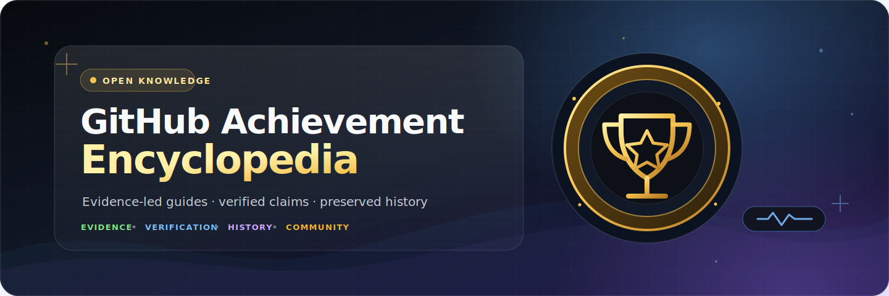
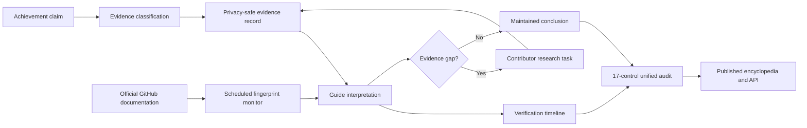

<p align="center">
  
</p>

<p align="center">
  <a href="https://github.com/Conroy1988/Achievements/actions/workflows/content-quality.yml"></a>
  <a href="https://github.com/Conroy1988/Achievements/actions/workflows/repository-audit.yml"></a>
  <a href="https://conroy1988.github.io/Achievements/"></a>
  <a href="docs/api-reference.md"></a>
  <a href="LICENSE"></a>
  <a href="MAINTENANCE.md"></a>
</p>

<p align="center">
  <strong>The evidence-led reference for GitHub profile achievements.</strong><br>
  Discover what each achievement means, how it is earned, which thresholds are verified,
  what remains uncertain, and how every conclusion is reviewed.
</p>

<p align="center">
  <a href="https://conroy1988.github.io/Achievements/"><strong>Explore the encyclopedia</strong></a>
  ·
  <a href="https://conroy1988.github.io/Achievements/search/">Search and filter</a>
  ·
  <a href="docs/evidence-register.md">Inspect evidence</a>
  ·
  <a href="docs/research-hub.md">Join the research</a>
  ·
  <a href="docs/api-reference.md">Use the API</a>
</p>

---

<table align="center">
  <tr>
    <td align="center"><strong>7</strong><br><sub>Active achievements</sub></td>
    <td align="center"><strong>2</strong><br><sub>Retired achievements</sub></td>
    <td align="center"><strong>16</strong><br><sub>Public API endpoints</sub></td>
    <td align="center"><strong>17</strong><br><sub>Unified audit controls</sub></td>
  </tr>
</table>

## More than a badge list

GitHub does not publish complete rules for every achievement or tier. That creates a difficult mix of official documentation, reproducible behaviour, historical evidence, account observations, and community folklore.

The **GitHub Achievement Encyclopedia** separates those sources instead of presenting every claim with equal certainty.

| Evidence-led | Research-ready | Machine-readable |
|---|---|---|
| Material claims are classified, dated, and linked to reviewable evidence records. | Known gaps become bounded tasks with reproducibility and privacy requirements. | Validated datasets and static JSON endpoints preserve classifications, dates, decisions, and limitations. |
| [See the confidence model](docs/evidence-strength-levels.md) | [Open the research hub](docs/research-hub.md) | [Open the API reference](docs/api-reference.md) |

> [!IMPORTANT]
> Numerical thresholds that GitHub has not officially documented remain clearly labelled as community-reported or otherwise unconfirmed until independently reproduced.

## Achievement catalogue

### Active achievements

| Achievement | What it recognises | Tiered | Guide |
|---|---|:---:|:---:|
| **Pull Shark** | Having pull requests merged | Yes | [Open guide](docs/achievements/pull-shark.md) |
| **Quickdraw** | Closing an issue or pull request shortly after opening it | No | [Open guide](docs/quickdraw.md) |
| **YOLO** | Merging a pull request without review | No | [Open guide](docs/achievements/yolo.md) |
| **Pair Extraordinaire** | Co-authoring commits in merged pull requests | Yes | [Open guide](achievements/pair-extraordinaire.md) |
| **Galaxy Brain** | Receiving accepted answers in GitHub Discussions | Yes | [Open guide](docs/achievements/galaxy-brain.md) |
| **Starstruck** | Owning a repository that receives stars | Yes | [Open guide](docs/achievements/starstruck.md) |
| **Public Sponsor** | Publicly sponsoring open-source work through GitHub Sponsors | No | [Open guide](docs/achievements/public-sponsor.md) |

### Retired achievements

| Achievement | Historical trigger | Status | Guide |
|---|---|:---:|:---:|
| **Arctic Code Vault Contributor** | Contributing to qualifying repositories included in the 2020 archive | Retired | [Open guide](docs/arctic-code-vault-contributor.md) |
| **Mars 2020 Contributor** | Contributing to repositories used by the Mars 2020 mission | Retired | [Open guide](docs/mars-2020-contributor.md) |

Use the [interactive search](search.md) for aliases and combined filters, or the [canonical index](docs/achievement-index.md) for a compact non-JavaScript route.

## From claim to maintained conclusion



| Evidence level | Meaning |
|---|---|
| **Official** | Directly documented by GitHub |
| **Confirmed** | Reproduced with sufficient dated evidence |
| **Observed** | Supported by credible observations without full reproduction |
| **Community-reported** | Third-party reporting without adequate independent confirmation |
| **Unknown** | Insufficient evidence for a reliable claim |

## Research infrastructure

| Surface | Purpose |
|---|---|
| [Public evidence register](docs/evidence-register.md) | One privacy-safe baseline record for every canonical achievement |
| [Evidence register policy](docs/evidence-register-policy.md) | Publication, provenance, privacy, contradiction, and review rules |
| [Official documentation monitor](docs/official-document-monitor.md) | Reviewed fingerprints for six official GitHub documentation pages |
| [Verification timelines](docs/verification-timelines.md) | Dated review history and explicit historical gaps for all nine achievements |
| [Contributor research hub](docs/research-hub.md) | Eight bounded tasks, including three good-first research opportunities |
| [Structured research issue form](.github/ISSUE_TEMPLATE/research-task.yml) | Reproduction method, dated results, limitations, and research declarations |

## Public data API

The static API exposes:

- discovery and schema metadata;
- the complete achievement catalogue;
- one endpoint per achievement;
- public evidence records;
- verification timelines;
- the contributor research queue; and
- live repository-health state.

Start with [`api/index.json`](api/index.json) or read the [API reference](docs/api-reference.md).

> [!NOTE]
> Structured delivery never strengthens a claim. Consumers should preserve evidence level, reviewer decision, reproduction state, dates, precision, limitations, and task status.

## Built for trust

| Control | What it protects |
|---|---|
| **Repository-wide Markdown** | Consistent documentation across repository-owned files |
| **Catalogue and data contracts** | Names, routes, tiers, dates, and guide metadata cannot drift |
| **Evidence and timeline contracts** | Claims, review dates, chronology, and privacy-safe outputs remain aligned |
| **Official-document baseline contract** | Monitored GitHub documentation has reviewed, valid fingerprints |
| **Contributor research contract** | Tasks remain bounded, referenced, and measurable |
| **Source resilience inventory** | External references remain visible and maintainable |
| **Public API drift validation** | Generated core and research endpoints remain canonical |
| **Search, Jekyll, and visual checks** | The public experience remains functional and stable |
| **Unified repository audit** | Seventeen controls produce one authoritative Markdown and JSON result |

Run the complete audit locally with:

```bash
python scripts/repository_audit.py
```

## Project map

| Area | Purpose |
|---|---|
| [`search.md`](search.md) | Accessible search and filtering |
| [`docs/achievement-index.md`](docs/achievement-index.md) | Canonical achievement catalogue |
| [`data/achievements.json`](data/achievements.json) | Canonical achievement records |
| [`data/evidence-register.json`](data/evidence-register.json) | Canonical public evidence records |
| [`data/verification-timelines.json`](data/verification-timelines.json) | Canonical review histories |
| [`data/research-queue.json`](data/research-queue.json) | Canonical contributor research tasks |
| [`docs/api-reference.md`](docs/api-reference.md) | Public API documentation |
| [`docs/repository-audit.md`](docs/repository-audit.md) | Unified 17-control audit contract |
| [`docs/health-dashboard.md`](docs/health-dashboard.md) | Generated operational health view |
| [`CONTRIBUTING.md`](CONTRIBUTING.md) | Contribution requirements |
| [`MAINTENANCE.md`](MAINTENANCE.md) | Review cadence and evidence ageing |
| [`RELEASES.md`](RELEASES.md) | Semantic-version release policy |

## Project principles

1. **Evidence before certainty.** Community observations are never presented as official fact.
2. **No artificial engagement.** The project does not promote spam, fake contributions, or deceptive activity.
3. **Dates matter.** Verification and review dates make evidence age visible.
4. **Corrections remain traceable.** Disputed or superseded claims are corrected through reviewable history.
5. **Historical context is preserved.** Retired achievements remain documented without being presented as earnable.
6. **Structured data retains uncertainty.** JSON delivery never strengthens a claim.
7. **Privacy is non-negotiable.** Research excludes credentials, private repository data, billing details, and unnecessary personal identifiers.

## Contributing

Corrections, dated observations, independent reproductions, contradictory evidence, source replacements, accessibility improvements, and data-contract changes are welcome.

Start with the [contributor research hub](docs/research-hub.md), then use the [structured research form](https://github.com/Conroy1988/Achievements/issues/new?template=research-task.yml) or follow the [contribution guidelines](CONTRIBUTING.md).

> [!NOTE]
> A useful contribution does not need to prove a claim. Well-documented uncertainty and failed reproduction attempts can materially improve the reference.

## Maintenance and verification

- **Weekly:** unified audit, official-document monitoring, links, freshness, research contracts, health refresh, and visual comparison.
- **Monthly:** issue, workflow, dependency, source availability, and evidence review.
- **Quarterly:** source freshness and award-behaviour sampling.
- **Annually:** complete guide, governance, accessibility, metadata, automation, dataset, API, and research review.
- **Event-driven:** immediate review after relevant GitHub product changes.

---

<p align="center">
  <strong>Accuracy over folklore. Evidence over assumption. History without ambiguity.</strong>
</p>

<p align="center">
  <a href="https://conroy1988.github.io/Achievements/">Live encyclopedia</a>
  ·
  <a href="https://conroy1988.github.io/Achievements/search/">Search</a>
  ·
  <a href="docs/research-hub.md">Research</a>
  ·
  <a href="docs/api-reference.md">API</a>
  ·
  <a href="docs/health-dashboard.md">Health</a>
  ·
  <a href="LICENSE">MIT Licence</a>
</p>

<p align="center">
  Maintained by <a href="https://github.com/Conroy1988">Conroy1988</a> for the GitHub community.
</p>
